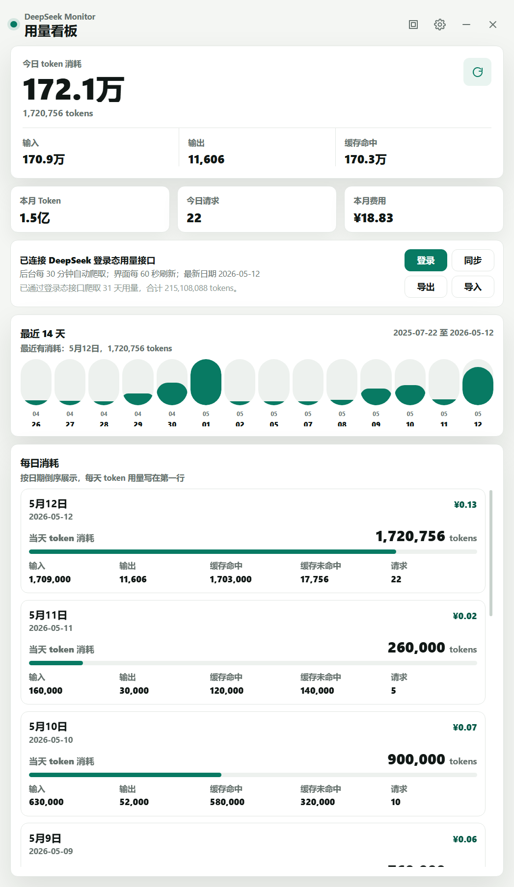

# DeepSeek Monitor

DeepSeek Monitor 是一个本地桌面端 DeepSeek 用量看板。启动后点击“登录”，在弹出的 DeepSeek 官方页面完成登录，应用就会自动读取登录态并同步 Usage 用量数据，不需要填写 API Key。



## 主要功能

- 登录 DeepSeek 官方 Usage 页面后自动同步用量。
- 展示今日 token、本月 token、今日请求、本月费用和最近 14 天趋势。
- 后台定时更新，登录窗口同步成功后会自动关闭。
- 支持导入 DeepSeek Usage 导出的 CSV/ZIP 文件补历史数据。
- API Key 为可选项，仅用于本地代理转发请求和余额查询。

## 安装

需要先安装 Git、Node.js 22.12+ 和 npm。

```powershell
git clone https://github.com/keepgoingzhx/Deepseek_Monitor.git
cd Deepseek_Monitor
npm install
npm start
```

## 使用

1. 启动应用：`npm start`
2. 点击主界面的“登录”按钮。
3. 在弹出的 DeepSeek 官方页面里自行登录。
4. 登录完成后停留片刻，应用会自动检测登录态并同步用量。
5. 如果没有马上同步，点击“同步”手动触发一次。

打开登录页期间，应用会每 15 秒检测一次登录态；同步成功后会在后台每 30 分钟更新一次。

## 数据与安全

- 账号密码只在 DeepSeek 官方页面输入，本项目不会接收或上传你的密码。
- 用量数据保存在本机。
- 本地接口只监听 `127.0.0.1`，不会对局域网开放。
- `.local/`、`.env*`、CSV/ZIP 导出文件和 `node_modules/` 已加入 `.gitignore`。

## 开发检查

```powershell
npm run check
```

## License

MIT
